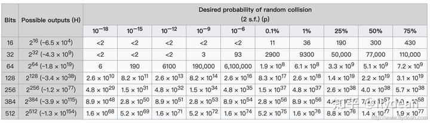
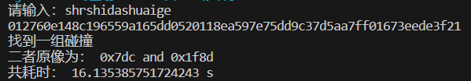

# SM3生日攻击
## 1、对SM3的实现

首先，我们实现SM3的各操作以复现SM3，各函数的作用如下：

* ``out_hex(list1)``: 这个函数用于打印16进制的输出。这对调试和验证实现的正确性是有用的。
* ``rotate_left(a, b)``: 这个函数用于执行左旋转操作，它是SM3哈希函数的重要部分之一。
* ``T_j``: 这个列表用于存储常量T(j)，这些常量在SM3函数中使用。
* ``FF_j(X, Y, Z, j)和GG_j(X, Y, Z, j)``: 这两个函数用于计算SM3函数中涉及到的复杂逻辑操作。具体的函数表达式可以在SM3的算法描述中找到。
* ``P_0(X)和P_1(X)``: 这两个函数用于计算SM3函数中的置换操作。
* ``CF(V_i, B_i)``: 这是SM3哈希函数的主要部分，它对输入的消息进行压缩。
* ``hash_msg(msg)``: 这个函数能够实现对整个消息的哈希计算。
* ``str2byte(msg),byte2str(msg),hex2byte(msg),byte2hex(msg)``: 这些函数便于在字符串，字节和十六进制之间进行转换。在处理消息和计算哈希时，这些转换是必要的。
* ``Hash_sm3(msg,Hexstr = 0)``: 这个函数将上述所有的步骤结合在一起，实现了完整的SM3哈希函数。如果提供的消息是一个hex字符串，可以通过设置Hexstr参数为1来处理它。
* ``KDF(Z,klen)``: 这个函数是密钥派生函数（Key Derivation Function），它使用哈希函数生成一串更长的密钥。在进行密钥交换或是其他需要长密钥的操作时，这是非常有用的。

## 2、生日攻击原理
假设有一个函数f，它的输出范围是H，那么我们的攻击就是找到两个不同的x，y，让f(x)=f(y)。

这时候，我们可以称x和y发生了碰撞。

根据概率论的公式，我们想要达到50%的几率，那么需要尝试的次数是:
$$Q(H) \approx \sqrt{\frac{\pi}{2} H}$$
如果以bits位来表示可能计算出的结果的话，我们可以参考下面的概率表：

## 3、生日攻击实现
首先，我们随机选择一个字符串进行哈希，并将哈希值存储起来，我们建立一个临时列表``sm3_list``，存储已经哈希过的串，以用于检测是否产生碰撞。

随后每次进行遍历时，遍历列表检测是否有碰撞发生，若有，输出值并结束；没有则将值放入列表。此处我们可以利用散列表的思想简化检索，利用哈希值的某些函数作为索引，以减少遍历列表的时间。

由于生日攻击复杂度较高，我们仅碰撞其前几位，若有碰撞发生，再检测这个不完全碰撞是否是真的碰撞。

## 4、结果

