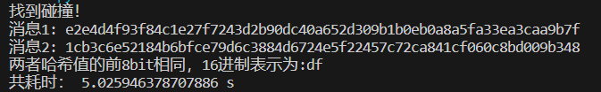
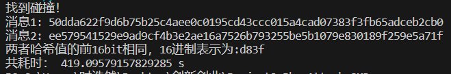

# implement the Rho method of reduced SM3

## 1、原理

SM3是一种密码学上的散列函数，与MD5和SHA系列相类似。散列函数存在一些特定的攻击，如碰撞攻击，预映像攻击和第二预映像攻击等，其中一个特殊的攻击方式就是`rho（ρ）攻击`。

`rho攻击`是基于数学上的`Pollard’s rho`算法，它是一种用于寻找大整数的因子或者离散对数问题的解的随机方法。在密码学的上下文中，`rho攻击`更多时候是用来解散列函数的。`rho攻击`基于一个理论，即在一个有限的数值域中，任意的大序列最终都会陷入一个循环。

在散列函数攻击的语境下，`rho攻击`的思路如下：

1. 选择一对任意不等的初始值 $x_0$ 和 $x’_0$ ；
2. 定义两个序列，一个的生成速度是另一个的两倍，即 $x_{i+1} = F(x_i)$ ， $x_{i+1}' = F(F(x_i'))$ ，这里F()就是散列函数， 
 $x_{i+1}$ 和 $x_{i+1}'$ 是下一个迭代的值；
3. 在某个时刻，两个序列将会相交，即存在某个i使得 $x_i$ = $x’_j$（i不等于j）出现；此时一个序列是相交点到循环开始点的路径，另一个序列则是从循环开始点开始的循环路径；
4. 通过比对两个序列相遇的地方，可以得到一对碰撞，即存在a，b（a不等于b），满足H(a) = H(b)，H()是散列函数。

这种攻击方法的成功取决于散列函数的设计以及其输出的适当长度。如果存在适量的碰撞，rho攻击可能会找到其中的一部分。然而，对于良好设计的散列函数，比如SM3，其防止碰撞的能力相当强大，使得这种攻击方法在实际中的效果会有较大的限制。

该方法是一种改进的生日攻击，其并不会优化运行速度，但是可以节省更多空间。与之前生日攻击中使用字典的方法类似，该方法并不会先开辟一可以容纳所有原像的空间，而是边寻找碰撞边存储，使得一些不必要的信息对可以不用存储。

若按照该方法找到一对相同的数据，则一定能够找到碰撞，其正确性证明如下：

## 2、代码使用说明
将``sm3``文件与``Rho attack``文件放在同一目录下运行即可

## 3、结果
由于全部碰撞时间较长，我们依旧采用碰撞部分bit的方法，部分结果如下：

碰撞前8位：

碰撞前16位：

