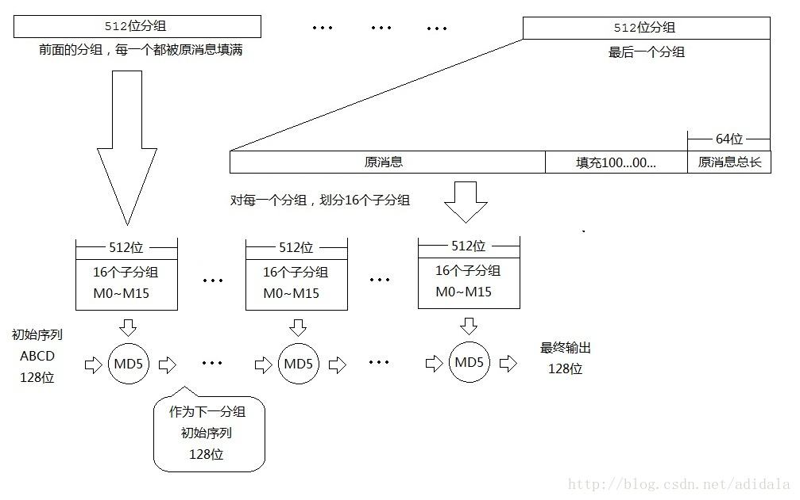
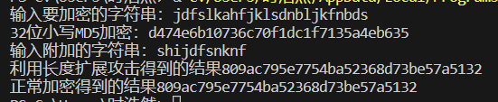

# implement length extension attack for md5
项目要求实现某种密码算法的长度扩展攻击，此处选择md5。

## md5加密及长度扩展攻击原理

md5加密将消息分为512位的分组，每组与初始向量或前一组的结果进行函数运算，最后一组的输出作为哈希值。

有一个问题就是，如果要是（加密的信息长度+64）并不是512的整数倍怎么办呢？

MD5的策略是：

最后一个分组如果不足512，则进行填充，填充的策略是：在原消息和原消息总长之间填充01字符串，第一位为1，剩下的全部填充0。

*这样其实就有了一个漏洞：*

如果给出一个message和该message经过md5加密后的值，我们可以通过手动填充，把消息长度填充到512的整数倍，再根据这个新的字符串，自己计算出md5值（因为有原message的md5值，相当于知道了加密的初始序列），同样可以成功。

由于现在的哈希函数加密都需要*加盐*，使哪怕相同的明文，加密后的密文也会不同，让黑客无法获取更多信息，因此长度扩展攻击会破坏这种*加盐*环境下的安全性，使攻击者无需知道salt信息，也能构造哈希值。

## 代码结果展示
我们将长度扩展攻击得到的结果与添加附加消息直接加密得到的结果进行比较，发现两者完全一致，证明结果正确。

