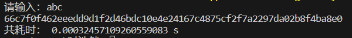
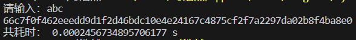

# Do your best to optimize SM3 implementation

首先展示未优化前`sm3`算法的运行时间：



我主要从以下方面进行了优化：


## 列表推导式：
Python 的列表推导式功能提供了一个简洁而强大的方法来创建和处理列表。在不牺牲可读性的情况下，列表推导式比传统的 for loop 能更快地生成列表。我使用列表推导式来创建初始的 $W$ 和 $W_1$ 列表，以及将计算的结果返回到 V_i_1 列表中。

```
    W = [(B_i[i*4]*0x1000000 + B_i[i*4+1]*0x10000 + B_i[i*4+2]*0x100 + B_i[i*4+3]) for i in range(16)]

    W.extend(0 for _ in range(52))

    for j in range(16, 68):
        W[j] = P_1(W[j-16] ^ W[j-9] ^ rotate_left(W[j-3], 15)) ^ rotate_left(W[j-13], 7) ^ W[j-6]

    W_1 = [W[j] ^ W[j+4] for j in range(64)]
```

在hash_msg函数中，bit_length_str 的计算和结果字符串的生成也都使用了列表解析形式。
```
    bit_length = len1 * 8
    bit_length_str = [(bit_length >> (i * 8) & 0xff) for i in reversed(range(8))]
```

## 计算优化：
在任何循环内部避免不必要的计算往往能够提高代码的运行速度。同样规则也适用这里的 for 循环，我预先计算了 $T_j$ 的 rotate_left 值，然后在循环中复用，这样可以避免在每次循环中都进行相同的计算。
```
    A, B, C, D, E, F, G, H = V_i
    T_j_rot = [rotate_left(T_j[j], j) for j in range(64)]
```

## 赋值操作：
Python 允许多变量同时赋值，这不仅使代码看起来更简洁，但在某些情况下也可以提高代码的效率。在代码中用了一系列的交换操作（比如 A = TT1, B = A, C = rotate_left(B, 9), D = C）。我将这些操作改为一行代码，这样可以减少中间变量的使用，因此可以减少不必要的内存操作。
```
    A, B, C, D = TT1, A, rotate_left(B, 9), C
    E, F, G, H = P_0(TT2), E, rotate_left(F, 19), H
```


## 减少不必要的变量创建：
在优化后的代码中，我避免了创建新的临时变量，例如在原始代码中的B []。对msg直接进行切片和操作可以减少内存消耗，提高代码执行的效率。

```
    for i in range(group_count):
        V.append(CF(V[i], msg[i*64:(i+1)*64]))
```

## 字符串拼接方法
在Python中，使用 + 连接大量字符串可能会导致效率低下。这是因为字符串在Python中是不可变的，每次 + 操作实际上会创建一个新的字符串并复制旧的内容。在优化的代码中，我们使用 "".join() 来连接字符串，这在处理大量字符串时，会更加高效。

```
    result = "".join([f'{i:08x}' for i in V[-1]])
```

## 优化结果
最终我实现了约1.5的加速比


