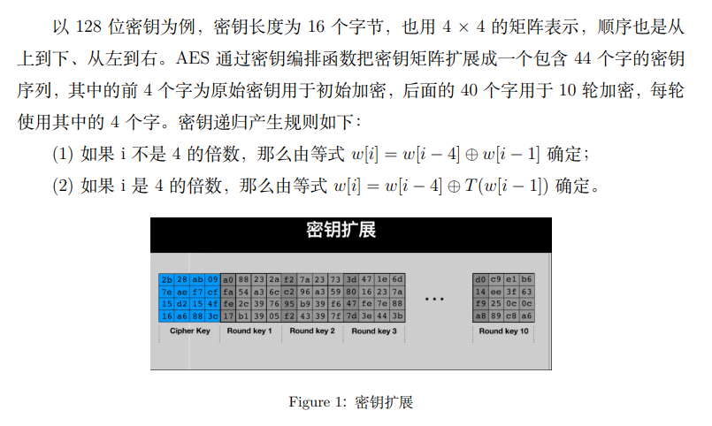
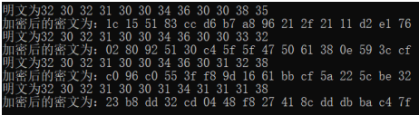
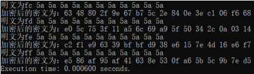
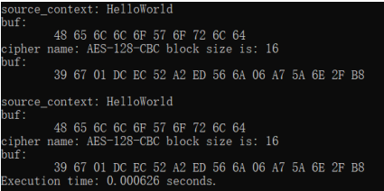

# AES software implementation

AES有多个版本，对于此实验，我在c++语言下实现了其aes-128版本

## 原理知识

### 密钥扩展


### 加密方案
加密时，明文按照 128 位为单位进行分组，每组包含  16 个字节，按照从上到下、
从左到右的顺序排列成一个 4 × 4 的矩阵，称为明文矩阵。AES 的加密过程在一个大小
同样为 4 × 4 的矩阵中进行，称为状态矩阵，状态矩阵的初始值为明文矩阵的值。每一轮加密结束后，状态矩阵的值变化一次。轮函数执行结束后，状态矩阵的值即为密文的
值，从状态矩阵得到密文矩阵，依次提取密文矩阵的值得到 128 位的密文。

加密的第 1 轮到第 9 轮的轮函数一样，包括 4 个操作：字节代换、行位移、列混合
和轮密钥加。最后一轮迭代不执行列混合。另外，在第一轮迭代之前，先将明文和原始
密钥进行一次异或加密操作。


## 结果展示
多次调用编写好的算法，其结果都与预期值相同，证明算法正确



## 与密码库进行比较
我们多次运行自己编写的算法，计算平均执行时间，并在mbedtls密码库中调用库中的aes算法，进行时间比较，其中调用密码库算法的代码和两者之间的比较如下：
```
clock_t start_time , end_time ;
double total_time ;
start_time = clock ( ) ; // 记 录 起 始 时 间
for ( int i = 0; i < 25600; i++) {
aes_test (MBEDTLS_CIPHER_AES_128_CBC) ;
}
end_time = clock ( ) ; // 记 录 结 束 时 间
total_time = ( double ) ( end_time - start_time ) / CLOCKS_PER_SEC; // 计 算 执 行 时 间
printf ( ” Execution time : %f seconds . \ n” , total_time /25600); // 输 出 执 行 时 间
```

自己编写的算法运行时间：



密码库算法运行时间：



可以看出，我们自主编写的aes-128算法速度已经优于mbedtls库。

