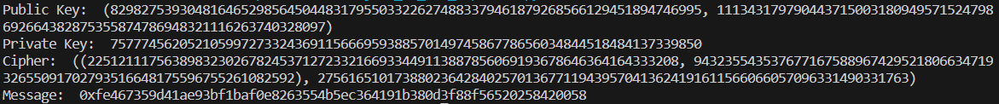

# Impl sm2 with RFC6979

## sm2算法原理

1、加密算法流程

* 用随机数发生器产生随机数k (k>1 k<n-1)
* 计算椭圆曲线点C1=[k]G=(x1,y1)，并将其转换为比特串（A的私钥生成公钥）
* 计算椭圆曲线点S=[h]Pb，若S是无穷远点，则报错并退出 h为n的余因子
* 计算椭圆曲线点[k]Pb=(x2,y2)，并将其转换为比特串（A的私钥乘B的公钥）
* 计算t=KDF(x2||y2,klen)，若t为全0比特串，则返回（一） KDF为密钥派生函数
* 计算C2=M⊕t
* 计算C3=Hash(x2||M||y2)
* 输出密文C=C1||C3||C2

2、解密算法流程
*  从C中取出比特串C1，将其转换为椭圆曲线上的点，验证C1是否满足椭圆曲线方程
* 计算椭圆曲线点S=[h]Pb，若S是无穷远点，则报错并退出
* 计算[db]C1=(x2,y2)，并将其转换为比特串 db B的公钥
* 计算t=KDF(x2||y2,klen)，若t为全0比特串，则返回（一） KDF为密钥派生函数
* 从C中取出比特串C2,计算M=C2⊕t
* 计算u=Hash(x2||M||y2)，从C中取出比特串C3，若u不等于C3，则报错并退出
* 输出明文M

签名算法见任务10的报告

## 代码实现及结果
我们对sm2需要的一些基于椭圆曲线的计算进行了实现，并最终实现了sm2。

