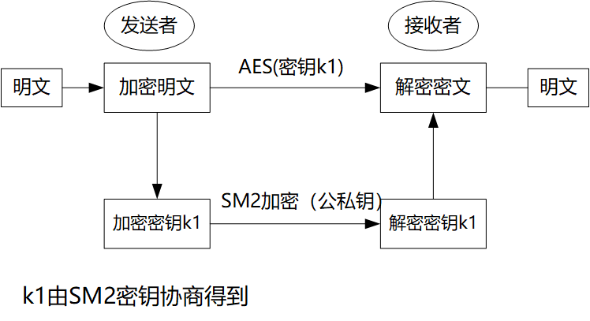
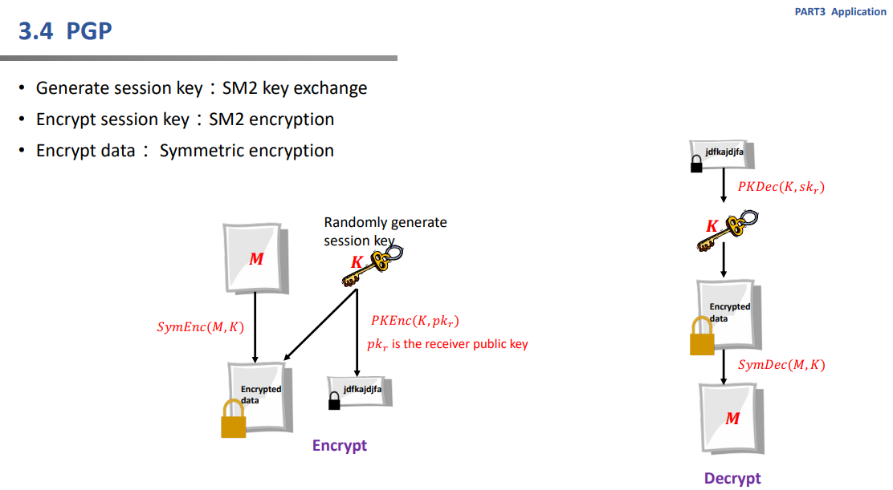
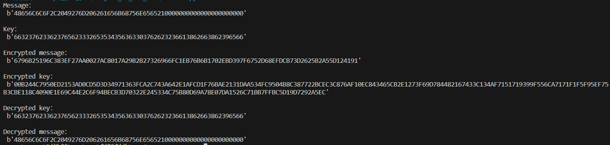

# Implement a PGP scheme with SM2

## PGP原理

PGP（Pretty Good Privacy）加密，由一系列散列、数据压缩、对称密钥加密，以及公钥加密的算法组合而成，每个步骤支持几种算法。

PGP支持消息认证和完整性检测：
* ①完整性检测被用来检查消息在传输过程中是否变更过（即验证消息完整性）；
* ②消息认证则是被用来决定消息是否确由某特定的人或实体发出（即数字签名验证）。

在PGP中，这些特性默认是和消息加密同时开启的，而且同样可以被应用到明文的验证。

发送者只需使用PGP为消息创建一个数字签名，即以数据或信息创建一个散列，然后使用发送者的私钥利用散列生成数字签名。



## 代码详解

首先我们定义了一些椭圆曲线上的点操作，包括：
* 模乘操作 `epoint_modmult`
* 加法运算 `epoint_add`
* 乘法运算 `epoint_mult`
  
接着我们利用`gmssl`库中的sm2和sm4相关函数进行操作，利用SM4加密函数对信息进行加密；利用SM2加密函数对密钥进行加密

```
sm4_obj = CryptSM4()
sm4_obj.set_key(key, SM4_ENCRYPT)
encrypted_msg = sm4_obj.crypt_ecb(msg)
encrypted_key = sm2_crypt.encrypt(key)
```

解密时调用相同的解密函数即可
```
decrypted_key = sm2_crypt.decrypt(encrypted_key)
sm4_obj = CryptSM4()
sm4_obj.set_key(decrypted_key, SM4_DECRYPT)
decrypted_msg = sm4_obj.crypt_ecb(encrypted_msg)
```

## 输出结果展示

