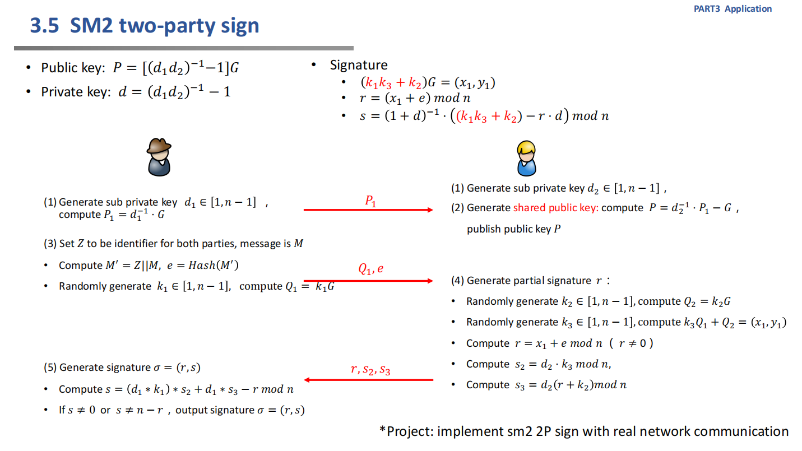

# Implement sm2 2P sign

## 基础知识
`sm2 2p sign`的知识介绍如下：

`"SM2 two-party sign"`指的是SM2密码算法的两方签名（Two-Party Signature）方案。SM2是中国国密算法中的非对称加密算法和数字签名算法，用于数据加密和身份验证。

在传统的非对称加密和数字签名中，通常需要两个主体，即签名者和验证者。签名者使用自己的私钥对消息进行签名，而验证者使用签名者的公钥来验证签名的有效性。这种过程涉及到两个主体之间的交互。

在两方签名方案中，两个主体合作执行签名过程，但在签名的结果中，每个主体都只贡献了部分签名信息，而不是完整的签名。这种方案通常用于分布式系统中或者在两个主体之间共享签名的情况下，以提高签名效率和安全性。




## 代码实现

在两方签名方案中，服务器端负责生成签名，而客户端负责验证签名的有效性。服务器端通过CryptSM2对象使用私钥对数据进行签名，客户端通过CryptSM2对象使用公钥来验证服务器生成的签名是否有效。

**实现思路如下：**

实例化SM2对象：通过给定的私钥和公钥，实例化CryptSM2对象，用于后续的签名和验证操作。

**服务器端(server_side)：**

1、绑定socket到指定的地址和端口，等待客户端连接。

2、监听连接请求，当有客户端连接时，接受连接。

3、接收客户端发送的数据。

4、使用SM2签名算法生成签名，其中还使用了一个随机的十六进制字符串作为辅助参数。

5、将签名编码为字节格式并发送给客户端。

6、清理连接，关闭socket。

部分代码示例如下
```
data = connection.recv(1024)
if data:
    # 使用SM2签名算法生成签名
    random_hex_str = func.random_hex(sm2_crypt.para_len)
    sign = sm2_crypt.sign(data, random_hex_str)
    print("服务器生成签名：",sign)

    # 将签名编码为字节格式并发送给客户端
    connection.sendall(sign.encode('utf-8'))
```

**客户端(client_side)：**

1、连接到服务器指定的地址和端口。

2、发送一条消息（这里是字符串"this is the message to be signed"）给服务器。

3、接收服务器返回的签名。

4、使用SM2公钥和签名来验证签名的有效性，如果签名有效，则打印"the signature is valid"，否则打印"the signature is invalid"。

5、关闭连接，关闭socket。

部分代码示例如下：

```
data = sock.recv(1024)
if data:
    # 验证签名
    # 使用bytes.decode()将字节解码为字符串格式
    data = data.decode('utf-8')
    print("接收到签名为",data)
    if sm2_crypt.verify(data, message):
        print("the signature is valid")
    else:
        print("the signature is invalid")
```

## 结果展示
服务器端：


客户端：


