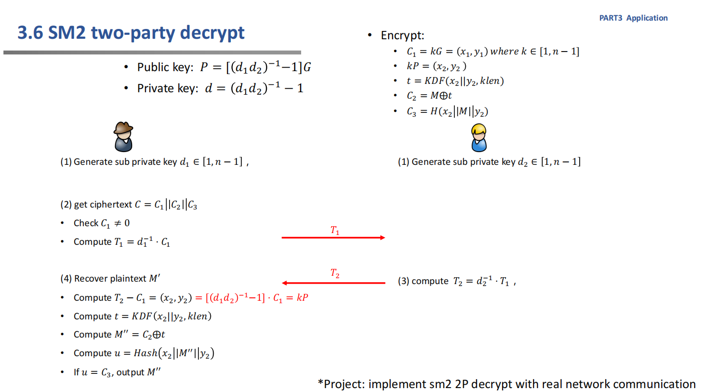
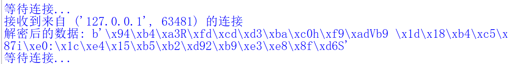

# Implement sm2 2P decrypt

## 实验原理

SM2是一种基于椭圆曲线密码系统的公钥密码算法标准，由中国国家密码管理局于2012年发布。下面描述的是两者之间如何进行解密操作。

## 流程

1. Alice生成密钥对，公钥为(PA, [xA, yA])，私钥为(SA)，并将公钥发送给Bob。
2. Bob接受到公钥后，将消息M用Alice的公钥进行加密，然后将加密后的结果C（由椭圆曲线点和密文消息两部分组成）发送给Alice。
3. Alice收到C后，使用私钥 SA 进行解密。

## 解密过程

1. Alice利用自己的私钥SA和消息的一部分（C1，一个椭圆曲线点）进行椭圆曲线上的点乘运算生成临时密钥，这个临时密钥在一次通讯过程中只能使用一次。
2. Alice利用这个临时密钥和消息的另一部分（C2，加密的消息）进行解密操作。加密解密过程对称。



## 代码思路及实现

1、**设置公钥和密钥**：客户端和服务器端都需要使用SM2算法对数据进行加密和解密，这就需要各自拥有公钥和私钥。公钥用于加密数据，私钥用于解密数据。在此例中，服务器会提供它的公钥给客户端，用于加密数据。

```
# SM2公私钥对（使用默认曲线初始化加密工具时会自动生成）
public_key = '04cd6bd2cadbff81f8e3d6f8a11977cf1722e4febd9660aa9c1cbd8a78a2f8d5193408ca5d132512a412fc838d84f543cf9d4d06892a5278844c20a293b390f1e5'
private_key = '6f27241950903d0136c84f605d1565470525255bf8c321ecba7c748e57c8b7d6'
```

2、**创建套接字**：一般来说，网络通信会借助套接字（socket）。套接字是在两台或者更多的计算机、或者同一台计算机的不同进程之间，实现网络通信的一种方式。这也是我们需要导入 socket 模块的原因。


3、**连接到服务器**：客户端使用 connect 方法试图连接到服务器。

```
# 创建 socket 对象
server_socket = socket.socket(socket.AF_INET, socket.SOCK_STREAM)
# 绑定地址
server_socket.bind(("localhost", 8888))
# 开始监听连接
server_socket.listen(1)
while True:
   print('等待连接...')
   client_socket, addr = server_socket.accept()

   print(f'接收到来自 {addr} 的连接')
```

4、**加解密数据**：在连接建立后，我们需要发送一些数据。在这里，我们先创建了一个 CryptSM2 实例，并使用服务器的公钥进行初始化。然后我们将公司明文（这里是 'Hello, this is a message from client!'）用 encode 方法转换成字节流，然后使用 CryptSM2 实例的 encrypt 方法进行加解密。

```
   crypt_sm2 = CryptSM2(private_key=private_key,public_key=public_key)
   encrypted_data = client_socket.recv(2048)
   decrypted_data = crypt_sm2.decrypt(encrypted_data)
   print('解密后的数据:', decrypted_data)
```

5、**发送数据**：我们使用 send 方法将加密的数据发送到服务器。这里的 send 方法接受字节流作为参数，所以我们不需要再次对数据进行编码。

6、**关闭连接**：在数据发送完毕后，我们需要关闭和服务器的连接。这里使用了套接字的 close 方法。

## 运行方法
先运行server.py，再运行client.py即可

## 结果展示


