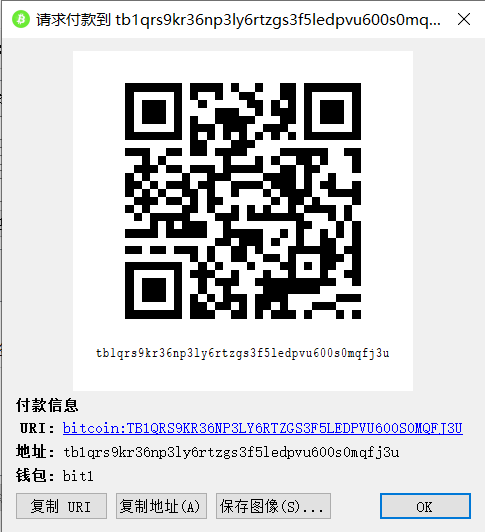
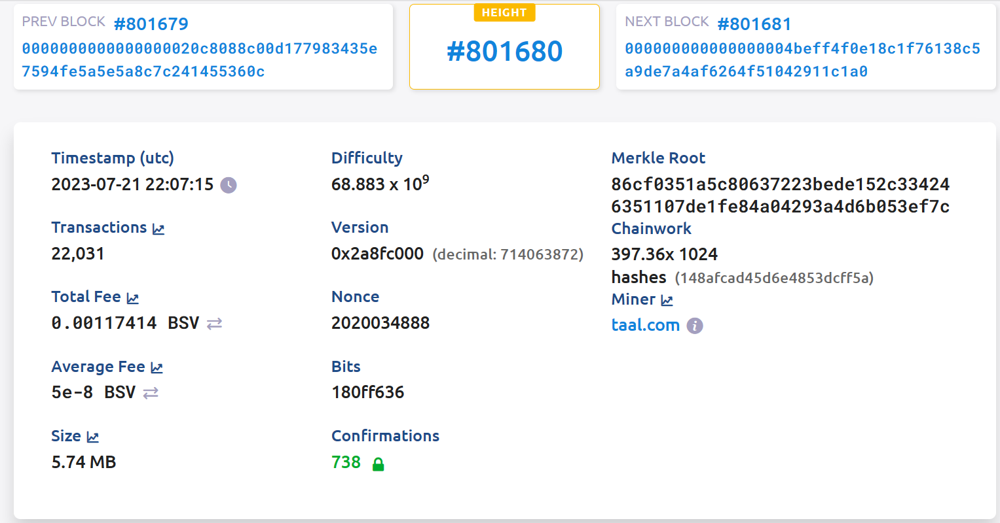
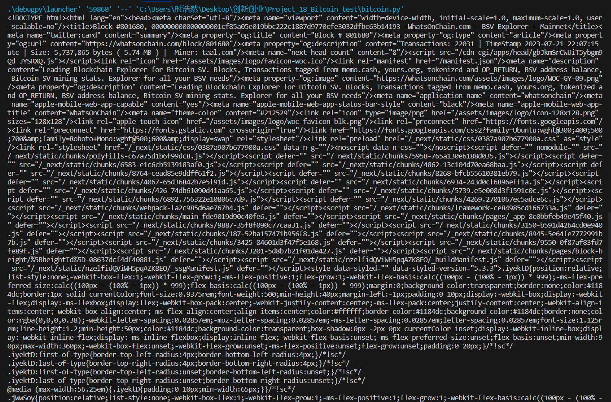

# Bitcoin testnet trade

## 项目内容

send a tx on Bitcoin testnet, and parse the tx data down to every bit, better write script yourself

## 建立测试网络钱包账户
下载bitcoin testnet的客户端，进入测试网络的客户端，建立一个钱包如下

## 发布交易
我在此处使用的比特币模拟网络为https://whatsonchain.com/，交易信息如下

## 编写脚本获取信息
到此处基本已获取交易信息，但我们也可用脚本来完成，截取后结果如下。

不难看出前几行包含了我们所需的信息，与平台所显示内容相符。

