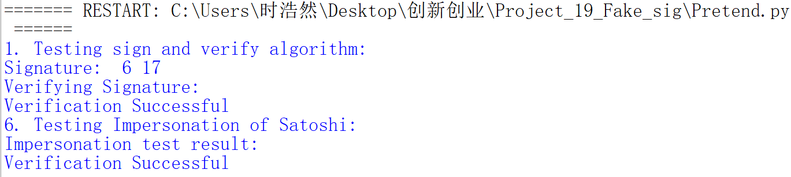

# Forge a signature to pretend that you are Satoshi

## 思路过程
我们定义一些圆锥曲线的操作以完成签名的实现：
```
def Check_Coprime(a, b):
    while a != 0:
        a, b = b % a, a
    return b

def Calc_GCD(a, m):
    if Check_Coprime(a, m) != 1 and Check_Coprime(a, m) != -1:
        return None
    u1, u2, u3 = 1, 0, a
    v1, v2, v3 = 0, 1, m
    while v3 != 0:
        q = u3 // v3
        v1, v2, v3, u1, u2, u3 = (u1 - q * v1), (u2 - q * v2), (u3 - q * v3), v1, v2, v3
    if u1 > 0:
        return u1 % m
    else:
        return (u1 + m) % m

def Add_CurvePoints(m, n):
    if (m == 0):
        return n
    if (n == 0):
        return m
    res = []
    if (m != n):
        if (Check_Coprime(m[0] - n[0], p) != 1 and Check_Coprime(m[0] - n[0], p) != -1):
            return 0
        else:
            k = ((m[1] - n[1]) * Calc_GCD(m[0] - n[0], p)) % p
    else:
        k = ((3 * (m[0] ** 2) + a) * Calc_GCD(2 * m[1], p)) % p
    x = (k ** 2 - m[0] - n[0]) % p
    y = (k * (m[0] - x) - m[1]) % p
    res.append(x)
    res.append(y)
    return res

def Multiply_CurvePoints(n, l):
    if n == 0:
        return 0
    if n == 1:
        return l
    t = l
    while (n >= 2):
        t = Add_CurvePoints(t, l)
        n = n - 1
    return t
```

在定义基本操作之后，我们对签名和验签进行实现，分别为函数`Sign_ECDSA`和`ECDSA_Verification`。

在伪装函数Impersonation中，我们利用与pitfall中基本相同的思路，对签名进行伪装，结果如下，可以看出伪装成功。

