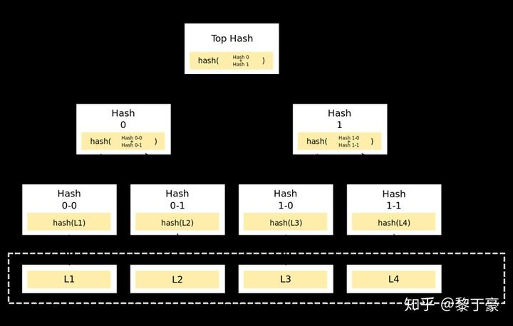
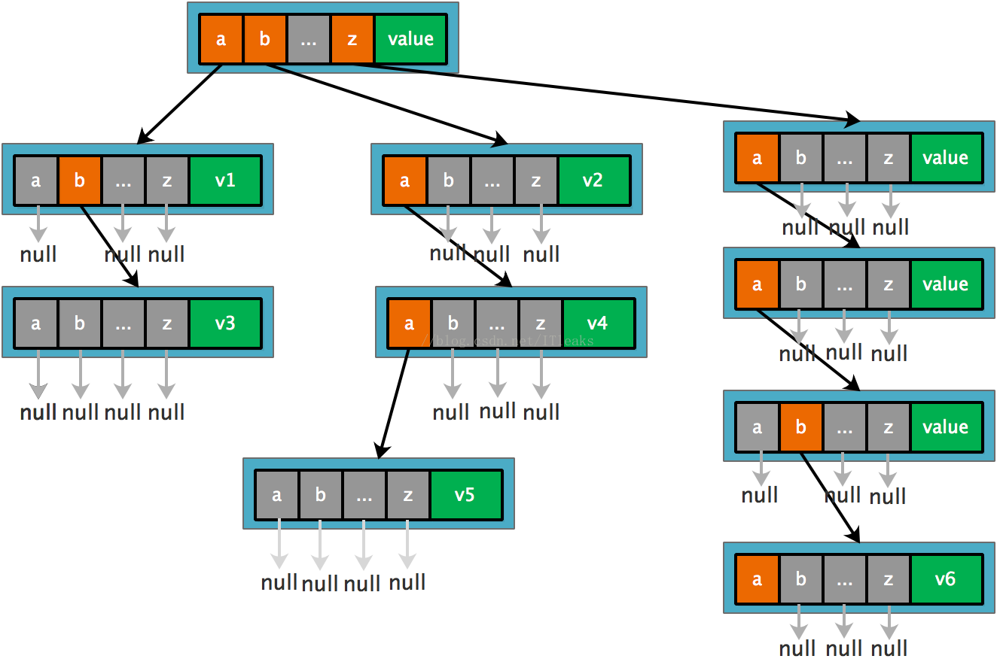
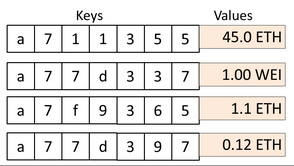
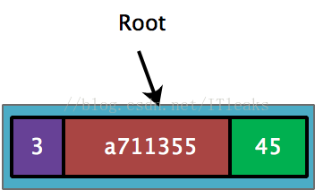
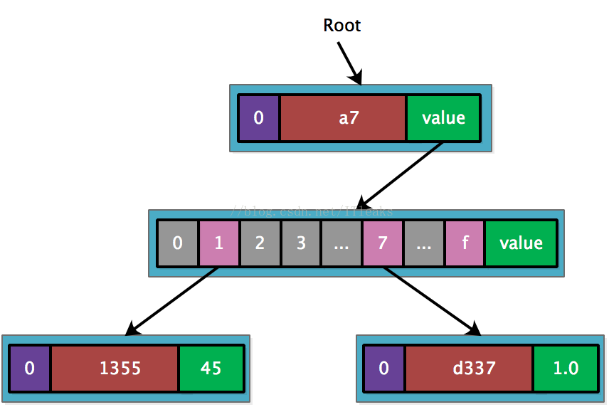
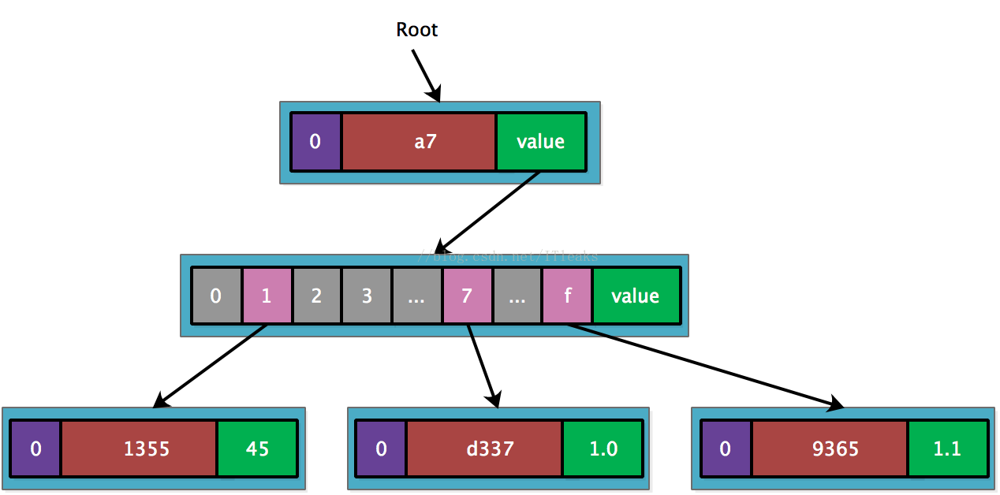
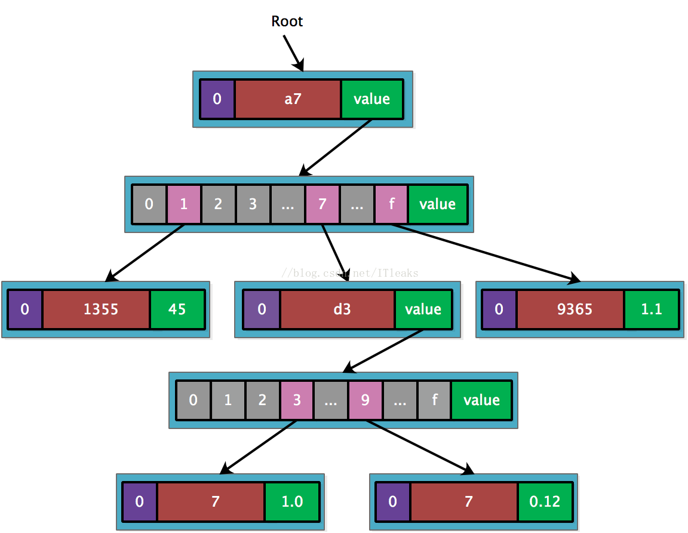

# Research report on MPT
## merkle tree
Merkle树是由计算机科学家 Ralph Merkle 在很多年前提出的，并以他本人的名字来命名,由于在Bitcoin网络中用到了这种数据结构来进行数据正确性的验证，在这里简要地介绍一下merkle树的特点及原理。

在Bitcoin网络中，merkle树被用来归纳一个区块中的所有交易，同时生成整个交易集合的数字指纹。此外，由于merkle树的存在，使得在Bitcoin这种公链的场景下，扩展一种“轻节点”实现简单支付验证变成可能。

**特点**

* Merkle tree是一种树，大多数是二叉树，也可以多叉树，无论是几叉树，它都具有树结构的所有特点；
* Merkle tree叶子节点的value是数据项的内容，或者是数据项的哈希值；
* 非叶子节点的value根据其孩子节点的信息，然后按照Hash算法计算而得出的；

将相邻两个节点的哈希值合并成一个字符串，然后计算这个字符串的哈希，得到的就是这两个节点的父节点的哈希值。

如果该层的树节点个数是单数，那么对于最后剩下的树节点，这种情况就直接对它进行哈希运算，其父节点的哈希就是其哈希值的哈希值（对于单数个叶子节点，有着不同的处理方法，也可以采用复制最后一个叶子节点凑齐偶数个叶子节点的方式）。循环重复上述计算过程，最后计算得到最后一个节点的哈希值，将该节点的哈希值作为整棵树的哈希。

若两棵树的根哈希一致，则这两棵树的结构、节点的内容必然相同。

## Trie树
`Trie`，又称前缀树或字典树，是一种有序树状的数据结构，其中的键通常是字符串，常用语存储`Key-value`数据结构。

`Trie`与二叉查找树不同，键不是直接保存在节点中，而是由节点在树中的位置决定。一个节点的所有子孙都有相同的前缀，节点对应的key是根节点到该节点路径上的所有节点key值前后拼接而成，节点的value值就是该key对应的值。根节点对应空字符串key。

如果key是英文单词，`trie`的每个节点就是一个长度为27的指针数组，index0-25代表a-z字符，26为标志域。

上面的存储的数据如下：

[‘a'] = V1, [‘ab’] = V3, [‘b’] = V2, [‘ba’] = V4,  [‘baa’] = V5, [‘zaab] = V6

从上面可以看出zaab这个key,没有和任何其他key共享字段，但是却产生了6层，这种无用的深度增加有什么方法减呢？Patricia Tree就可以解决这个问题

## Merkle Patricia Tree对trie的改进

上面tries出现的问题的根本原因是每个前置节点只能表示一个字母，key有多长，树的深度就会多长，不管这个key有没有和其他key共享部分key。因而允许一个节点表示变长的key就可以解决这个深度，具体以官方的下图为例：

上图存储的key-value如下：

从前面结构图可以看出，Merkle Patricia Tree有4种类型的节点：

* 叶子节点（`leaf`），表示为[key,value]的一个键值对。和前面的英文字母key不一样，这里的key都是16编码出来的字符串，每个字符只有0-f 16种，value是RLP编码的数据
* 扩展节点（`extension`），也是[key，value]的一个键值对，但是这里的value是其他节点的hash值，通过hash链接到其他节点
* 分支节点（`branch`），因为MPT树中的key被编码成一种特殊的16进制的表示，再加上最后的value，所以分支节点是一个长度为17的list，前16个元素对应着key中的16个可能的十六进制字符，如果有一个[key,value]对在这个分支节点终止，最后一个元素代表一个值，即分支节点既可以搜索路径的终止也可以是路径的中间节点。分支节点的父亲必然是extension node
* 空节点，代码中用null表示

## 原理解释

插入第一个<a711355, 45>，由于只有一个key,直接用leaf node既可表示

接着插入a77d337,由于和a711355共享前缀’a7’,因而可以创建’a7'扩展节点。

接着插入a7f9365,也是共享’a7’,只需新增一个leaf node.

最后插入a77d397,这个key和a77d337共享’a7’+’d3’,因而再需要创建一个’d3’扩展节点

参考文献：
- [以太坊 Merkle Patricia Tree 全解析](https://zhuanlan.zhihu.com/p/46702178)
- [以太坊MPT原理，你最值得看的一篇](https://blog.csdn.net/ITleaks/article/details/79992072)

